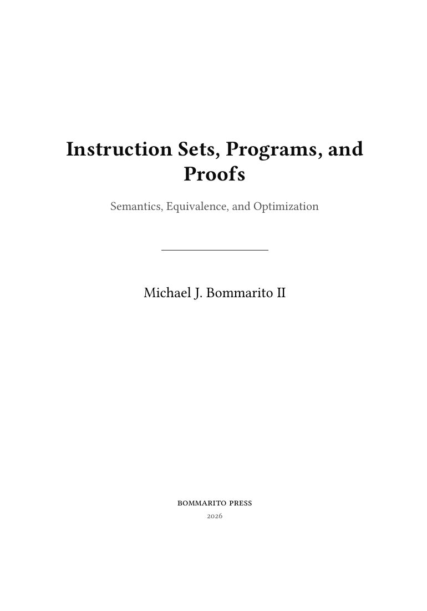

# Instruction Sets, Programs, and Proofs

*Semantics, Equivalence, and Optimization*

## Read the book

**[Read or download the PDF](downloads/instruction-sets-programs-and-proofs.pdf)**
&nbsp;·&nbsp;
**[Download the EPUB](downloads/instruction-sets-programs-and-proofs.epub)**

  

The linked title page opens the complete 553-page, 7×10 print PDF. The EPUB is
a complete reflowable edition with its diagrams embedded and has passed
`epubcheck` with no errors or warnings.
Build provenance and SHA-256 digests are recorded in
[`downloads/README.md`](downloads/README.md).

This repository contains a foundations textbook about instruction sets and
proofs of machine-program behavior.

The book develops three layers in order:

1. A0, a small abstract instruction set whose relevant semantics can be
   printed and executed in full;
2. source-pinned RV64 and x86-64 slices, developed in parallel as two different
   realizations of the same semantic questions; and
3. equivalence, refinement, cross-ISA simulation, bounded optimization, and
   evidence that a reader can independently challenge.

RISC and CISC are treated as architectural families, not as complete
semantics. Comparisons name the actual dimension: encoding length, operand
roles, implicit state, memory access, address formation, condition state,
control transfer, or ABI convention.

## Current state

The active book has an Introduction and sixteen chapters, totaling 182,440
chapter-source words and 67 rendered figures. The first sequential depth pass
is complete: every chapter is within its planned textbook-length band, with
worked examples, exercises, proof development, and explicit model boundaries.
The active ledger contains 42 definitions, principles, computations, and
implementation obligations following the A0, RV64, and x86-64 dependency
graph.

The first active artifact is a source-bound finite computation over all 8- and
16-bit A0 byte round trips. Its checker recomputes 65,792 cases, and its
reversed-byte-order control must fail. It is not a general theorem. Axeyum now
also has concrete A0 state, memory, decoder, instruction semantics, traps, and
bounded traces on its executable-curriculum branch. Proof-facing A0 formulas,
the real-ISA slices, and cross-machine relations remain open.

Legacy evidence-led chapters, objects, artifacts, producers, surveys, guide,
and paper are retained under the research archive. They do not feed the active
book, ledger, or reproduction gate.

## Contract

Every active object is a JSON record in the objects directory. Definitions say
what the book means. Claims must name scope. Checked evidence must name
versioned semantic inputs, an artifact, a checker, a trust class, and a
negative control that fails for a declared reason.

Generated chapter status text comes from the object ledger. Authors do not
type stronger status language into prose.

Active evidence belongs in the artifacts directory and follows its manifest
schema. A handwritten bit-vector formula is not an ISA semantics. A decoder is
not an execution model. Equal destination words are not cross-ISA refinement.

## Commands

    make ledger
    make artifact-check
    make check
    make check-run
    make book
    make -C book check

The runtime check executes the finite A0 byte-roundtrip computation and its
firing negative control. Every other planned machine route remains open.

## Layout

| Path | Purpose |
|---|---|
| downloads | Current PDF and EPUB builds, preview image, checksums, and provenance |
| book | Canonical manuscript, guides, outlines, and publication build |
| objects | Active A0, RV64, x86-64, relation, evidence, and obligation records |
| artifacts | Active manifest schema and future semantic and evidence packages |
| axeyum-guide | Required Axeyum layers, controls, and promotion procedure |
| scripts | Active ledger, artifact, and evidence gates |
| research/archive | Superseded material retained for provenance only |

The master outline governs the curriculum. The Axeyum evidence outline governs
the clean-sheet artifact design.

## License

MIT for active repository material. Archived third-party source material keeps
its original license.
